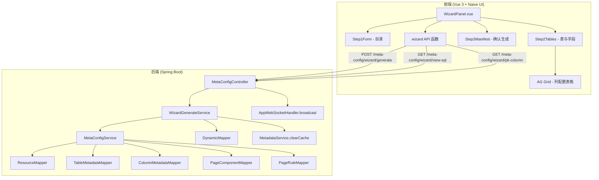
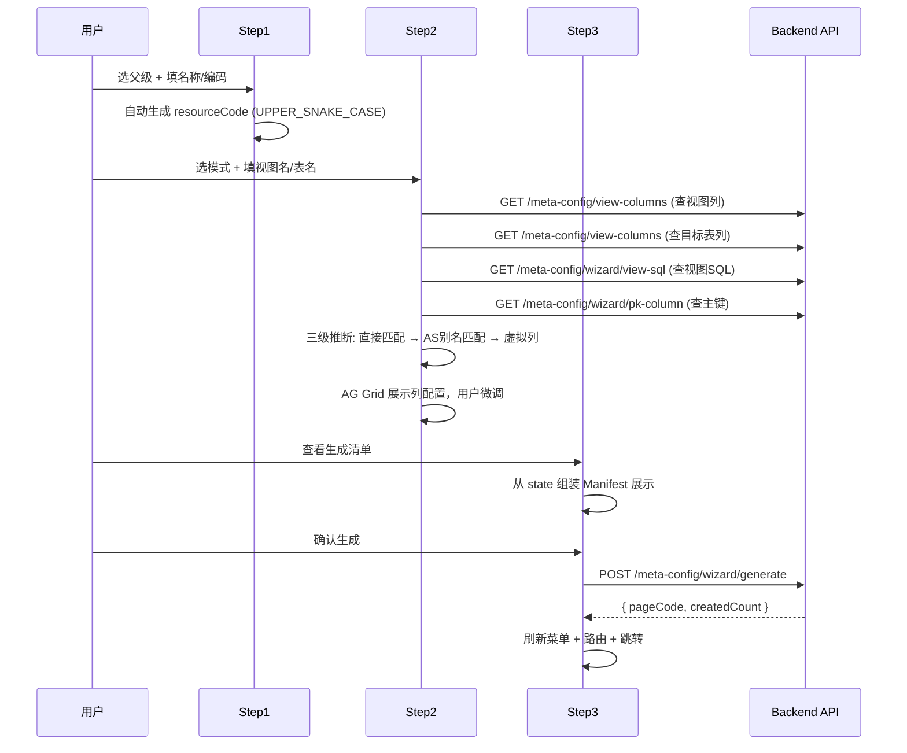

# Design Document: 页面创建向导 (Page Creation Wizard)

## Overview

页面创建向导将 10+ 步的手动页面配置流程压缩为 3 步向导：创建目录 → 导入表与配置字段 → 确认生成。后端通过单一事务性 API 在依赖顺序下批量创建 Resource、TableMetadata、ColumnMetadata、PageComponent、PageRule 五类实体，前端通过 NSteps 组件引导用户完成配置。

**核心设计决策：**
- 单一 POST 接口 + 事务保证原子性，避免多次请求的中间状态
- 前端组装完整 Payload，后端无需维护向导状态
- 复用已有 MetaConfigService 的 save 方法，保持一致的 ID 生成和审计字段逻辑
- 视图 SQL 解析采用正则 + 降级策略，容错优先

## Architecture



## Components and Interfaces

### Backend API

#### 1. POST `/meta-config/wizard/generate`

接收完整向导载荷，事务性生成所有元数据实体。

**Request Body (WizardPayload):**

```java
public class WizardPayload {
    // 第1步 - 目录
    private Long parentId;           // 父级资源 ID
    private String resourceName;     // 目录名称
    private String resourceCode;     // 目录编码 (UPPER_SNAKE_CASE)
    private String icon;             // 图标，默认 "folder"

    // 第2步 - 表配置
    private String mode;             // "single" | "master-detail"
    private String pageCode;         // 自动推导的页面编码
    private WizardTable masterTable; // 主表配置
    private List<WizardTable> detailTables; // 从表列表（主从模式）
}

public class WizardTable {
    private String queryView;        // 查询视图名
    private String targetTable;      // 目标表名
    private String tableCode;        // 表代码 (PascalCase)
    private String tableName;        // 表中文名
    private String pkColumn;         // 主键列（后端从约束获取）
    private String sequenceName;     // 序列名 = "SEQ_" + targetTable
    private String parentFkColumn;   // 从表关联字段（仅从表）
    private List<WizardColumn> columns; // 列配置
}

public class WizardColumn {
    private String columnName;       // 视图列名（即 FIELD_NAME）
    private String targetColumn;     // 写入目标列名
    private String headerText;       // 列标题
    private String dataType;         // text | number | date
    private Integer displayOrder;    // 排序号
    private Integer isVirtual;       // 0=真实, 1=虚拟
    private Boolean visible;         // 是否显示
    private Boolean editable;        // 是否可编辑
    private Boolean filterable;      // 是否可查询
    private String widgetType;       // text | number | date | select | checkbox
}
```

**Response:**

```json
{
  "code": 200,
  "data": {
    "pageCode": "cost-pinggu",
    "createdCount": 68
  }
}
```

#### 2. GET `/meta-config/wizard/pk-column?owner=CMX&tableName=T_COST_PINGGU`

查询目标表的主键列名（ALL_CONSTRAINTS + ALL_CONS_COLUMNS）。

**Response:**

```json
{
  "code": 200,
  "data": "DOCID"
}
```

### Backend Service: WizardGenerateService

```java
@Service
@RequiredArgsConstructor
public class WizardGenerateService {

    private final MetaConfigService metaConfigService;
    private final DynamicMapper dynamicMapper;
    private final MetadataService metadataService;

    @Transactional(rollbackFor = Exception.class)
    public WizardResult generate(WizardPayload payload) {
        // 1. 校验 pageCode 不重复
        // 2. 创建 Resource
        // 3. 遍历表：创建 TableMetadata（主表先，从表设 parentTableCode）
        // 4. 遍历表的列：创建 ColumnMetadata
        // 5. 创建 PageComponent（root LAYOUT → masterGrid GRID → detail DETAIL_GRID）
        // 6. 创建 PageRule（COLUMN_OVERRIDE + BUTTON）
        // 7. 清缓存
        return result;
    }

    /** 查询视图 SQL 定义 */
    public String getViewSql(String owner, String viewName) {
        String sql = "SELECT TEXT FROM DBA_VIEWS WHERE OWNER = '" 
            + owner.toUpperCase().replace("'","''") 
            + "' AND VIEW_NAME = '" 
            + viewName.toUpperCase().replace("'","''") + "'";
        List<Map<String, Object>> rows = dynamicMapper.selectList(sql);
        if (rows.isEmpty()) return null;
        Object text = rows.get(0).get("TEXT");
        // 处理 CLOB
        if (text instanceof java.sql.Clob clob) {
            try { return clob.getSubString(1, (int) clob.length()); }
            catch (Exception e) { return null; }
        }
        return text != null ? text.toString() : null;
    }

    /** 查询表主键列 */
    public String getPkColumn(String owner, String tableName) {
        String sql = "SELECT cc.COLUMN_NAME FROM ALL_CONSTRAINTS c " +
            "JOIN ALL_CONS_COLUMNS cc ON c.OWNER = cc.OWNER " +
            "AND c.CONSTRAINT_NAME = cc.CONSTRAINT_NAME " +
            "WHERE c.OWNER = '" + owner.toUpperCase().replace("'","''") +
            "' AND c.TABLE_NAME = '" + tableName.toUpperCase().replace("'","''") +
            "' AND c.CONSTRAINT_TYPE = 'P' ORDER BY cc.POSITION";
        List<Map<String, Object>> rows = dynamicMapper.selectList(sql);
        if (rows.isEmpty()) return null;
        return (String) rows.get(0).get("COLUMN_NAME");
    }
}
```

### Frontend Components

#### WizardPanel.vue（新 Tab 面板）

```
cost-web/src/views/_builtin/meta-config/
├── index.vue                    (修改：添加 wizard TabPane)
└── panels/
    └── WizardPanel.vue          (新增：向导主面板)
        ├── components/
        │   ├── WizardStep1.vue  (目录配置)
        │   ├── WizardStep2.vue  (表与字段配置)
        │   └── WizardStep3.vue  (确认生成)
        └── composables/
            └── useWizardState.ts (向导状态管理)
```

#### 状态管理 (useWizardState.ts)

```typescript
interface WizardState {
  currentStep: number; // 1 | 2 | 3
  step1: {
    parentId: number | null;
    resourceName: string;
    resourceCode: string;
    icon: string;
  };
  step2: {
    mode: 'single' | 'master-detail';
    pageCode: string;
    masterTable: WizardTableState;
    detailTables: WizardTableState[];
  };
}

interface WizardTableState {
  queryView: string;
  targetTable: string;
  tableCode: string;
  tableName: string;
  pkColumn: string;
  sequenceName: string;
  parentFkColumn: string; // 仅从表
  columns: WizardColumnState[];
  columnsLoaded: boolean;
}
```

状态使用 `reactive()` 管理，步骤切换不重置已填数据。

### Frontend API (wizard.ts)

```typescript
// cost-web/src/service/api/wizard.ts

/** 提交向导生成 */
export async function generateWizard(payload: WizardPayload) {
  const { data, error } = await request<{ pageCode: string; createdCount: number }>({
    url: '/meta-config/wizard/generate',
    method: 'POST',
    data: payload
  });
  if (error) throw error;
  return data;
}

/** 获取视图 SQL 定义 */
export async function fetchViewSql(viewName: string, owner = 'CMX') {
  const { data } = await request<string>({
    url: '/meta-config/wizard/view-sql',
    params: { viewName, owner }
  });
  return data || '';
}

/** 获取表主键列 */
export async function fetchPkColumn(tableName: string, owner = 'CMX') {
  const { data } = await request<string>({
    url: '/meta-config/wizard/pk-column',
    params: { tableName, owner }
  });
  return data || '';
}
```

同时复用已有 `fetchViewColumns` 和 `fetchAllResources` 接口。

## Data Models

### Payload 构建流程（前端 3 步 → 提交）



### 列分类逻辑（前端执行）

```typescript
function classifyColumns(
  viewColumns: OracleColumn[],
  targetColumns: string[]
): WizardColumnState[] {
  const targetSet = new Set(targetColumns.map(c => c.toUpperCase()));

  return viewColumns.map((vc, idx) => {
    const colUpper = vc.columnName.toUpperCase();
    // 视图列名直接匹配目标表列名（不区分大小写）
    if (targetSet.has(colUpper)) {
      return { ...defaults(vc, idx), isVirtual: 0, targetColumn: colUpper };
    }
    // 不匹配 → 虚拟列
    return { ...defaults(vc, idx), isVirtual: 1, targetColumn: '' };
  });
}
```

### 后端生成顺序与实体关系

| 步骤 | 实体 | 依赖 | 序列 |
|------|------|------|------|
| 1 | Resource | 无 | SEQ_COST_RESOURCE |
| 2 | TableMetadata (主表) | 无 | SEQ_COST_TABLE_METADATA |
| 3 | TableMetadata (从表) | 主表 tableCode | SEQ_COST_TABLE_METADATA |
| 4 | ColumnMetadata | TableMetadata.ID | SEQ_COST_COLUMN_METADATA |
| 5 | PageComponent (root) | 无 | SEQ_COST_PAGE_COMPONENT |
| 6 | PageComponent (grids) | root componentKey | SEQ_COST_PAGE_COMPONENT |
| 7 | PageRule (COLUMN_OVERRIDE) | PageComponent | SEQ_COST_PAGE_RULE |
| 8 | PageRule (BUTTON) | PageComponent | SEQ_COST_PAGE_RULE |

### COLUMN_OVERRIDE 生成规则

每个 COMPONENT_KEY 一条规则，RULES 为 JSON 数组：

```json
[
  {
    "columnName": "DOCID",
    "visible": false,
    "editable": false,
    "width": 80
  },
  {
    "columnName": "GOODS_NAME",
    "visible": true,
    "editable": true,
    "width": 160,
    "cellEditor": "text"
  },
  {
    "columnName": "FACTORYNAME",
    "visible": true,
    "editable": false,
    "width": 120
  }
]
```

**宽度映射规则：**
| 控件类型 | 默认宽度 |
|---------|---------|
| number | 100 |
| date | 120 |
| select | 130 |
| checkbox | 80 |
| text (≤10字标题) | 120 |
| text (>10字标题) | 160 |

**cellEditor 映射：**
| 控件类型 | cellEditor |
|---------|-----------|
| text | agTextCellEditor |
| number | agNumberCellEditor |
| date | datePicker |
| select | agSelectCellEditor |
| checkbox | agCheckboxCellEditor |

### BUTTON 规则生成

```json
{
  "toolbar": ["query", "add", "delete", "save"],
  "contextMenu": ["add", "delete"]
}
```

从表不含 "query" 按钮。

## Correctness Properties

*A property is a characteristic or behavior that should hold true across all valid executions of a system — essentially, a formal statement about what the system should do. Properties serve as the bridge between human-readable specifications and machine-verifiable correctness guarantees.*

### Property 1: Step navigation validation

*For any* wizard state, the "next" button SHALL be enabled if and only if all required fields of the current step are filled (Step1: parentId + resourceName + resourceCode; Step2: at least one table with queryView + targetTable + pkColumn and at least one column, plus all FK fields confirmed in master-detail mode).

**Validates: Requirements 1.3, 1.4, 5.3**

### Property 2: Wizard state preservation on navigation

*For any* wizard state with filled data, navigating backward (step N → step N-1) and then forward (step N-1 → step N) SHALL produce an identical state to the original.

**Validates: Requirements 1.5, 7.2**

### Property 3: Resource code generation and validation

*For any* non-empty resource name string, the auto-generated code SHALL match the pattern `^[A-Z0-9_]{1,64}$`, and for any manually entered code, acceptance SHALL hold if and only if it matches `^[A-Z0-9_]+$` with length ≤ 64.

**Validates: Requirements 2.3, 2.4**

### Property 4: Table/view name validation

*For any* input string for view name or table name fields, acceptance SHALL hold if and only if the string matches `^[A-Za-z0-9_]+$` with length ≤ 64.

**Validates: Requirements 3.7**

### Property 5: Column real/virtual classification with defaults

*For any* set of view columns V and target table columns T, a view column c SHALL be classified as real (IS_VIRTUAL=0) if and only if c.name (case-insensitive) exists in T. Real columns SHALL have TARGET_COLUMN set to the matched target column name, editable=true. Virtual columns SHALL have IS_VIRTUAL=1, TARGET_COLUMN='', editable=false.

**Validates: Requirements 4.3, 4.4, 4.5**

### Property 6: Oracle DATA_TYPE mapping

*For any* Oracle column definition, the mapped data type SHALL be: NUMBER/FLOAT → "number", DATE/TIMESTAMP → "date", all others → "text". The header text SHALL be COMMENTS if non-empty, otherwise COLUMN_NAME.

**Validates: Requirements 4.9, 6.4, 6.5**

### Property 7: FK pre-selection logic

*For any* master table PK column name P and detail table column list D, the system SHALL pre-select column X from D as FK if and only if X.toUpperCase() equals P.toUpperCase().

**Validates: Requirements 5.2**

### Property 8: Duplicate display order detection

*For any* column configuration list, validation SHALL fail if and only if there exist two columns with the same displayOrder value.

**Validates: Requirements 6.6**

### Property 9: Virtual column editable validation

*For any* virtual column (IS_VIRTUAL=1) with editable=true, validation SHALL fail if and only if its TARGET_COLUMN value does not exist in the target table's column set.

**Validates: Requirements 6.7**

### Property 10: Virtual-to-real column promotion

*For any* virtual column, if the user assigns a TARGET_COLUMN value that exists in the target table's column set (case-insensitive), the column SHALL be promoted to real (IS_VIRTUAL=0).

**Validates: Requirements 6.8**

### Property 11: Transaction dependency order

*For any* valid wizard payload, the backend generate function SHALL create entities in strictly this order: Resource → TableMetadata → ColumnMetadata → PageComponent → PageRule. No entity SHALL reference an ID that has not yet been created.

**Validates: Requirements 8.1**

### Property 12: Transaction atomicity on failure

*For any* wizard payload where step N of generation fails, all entities created in steps 1..N-1 SHALL be rolled back, resulting in zero new rows across all tables.

**Validates: Requirements 8.2**

### Property 13: Default button generation

*For any* single-table payload, the BUTTON rule SHALL contain exactly {query, add, delete, save}. *For any* master-detail payload with N detail tables, the master BUTTON rule SHALL contain {query, add, delete, save} and each detail BUTTON rule SHALL contain exactly {add, delete, save}.

**Validates: Requirements 9.1, 9.2**

### Property 14: Auto-derived identifiers

*For any* wizard table configuration: SEQUENCE_NAME SHALL equal "SEQ_" + TARGET_TABLE; COMPONENT_KEY SHALL equal the tableCode; PAGE_CODE SHALL be a valid kebab-case string derived from the view name (strip "V_" prefix) or resource code.

**Validates: Requirements 9.3, 9.4, 9.7**

### Property 15: COLUMN_OVERRIDE rule generation

*For any* wizard payload with columns, the system SHALL generate exactly one COLUMN_OVERRIDE PageRule per COMPONENT_KEY. Each rule's JSON array SHALL contain one entry per column where: visible matches the column's visibility flag; for columns that are still virtual at submission time (IS_VIRTUAL=1), editable is forced to false; for real columns (IS_VIRTUAL=0, including those promoted from virtual via TARGET_COLUMN), editable matches the user's setting; cellEditor matches the widget type mapping; width is between 60 and 600.

**Validates: Requirements 11.1, 11.2, 11.3, 11.4, 11.5, 11.6**

## Error Handling

| 场景 | 错误码 | 消息 | 处理方式 |
|------|--------|------|---------|
| 非 admin 用户 | 403 | 无权限访问 | @ModelAttribute 统一拦截 |
| pageCode 已存在 | 400 | 页面编码重复: {code} | 写库前校验，抛 BusinessException |
| 目标表无主键约束 | 400 | 目标表缺少主键定义 | getPkColumn 返回 null 时前端阻止 |
| 视图不存在 | 400 | 视图未找到: {name} | fetchViewColumns 返回空 |
| 目标表不存在 | 400 | 目标表未找到: {name} | fetchViewColumns 返回空 |
| 视图无列 | 400 | 未找到列信息 | 视图列查询结果为空 |
| 列元数据缺失 | 400 | 列配置不能为空 | payload.columns 为空时 |
| 从表超过 5 张 | — | 前端警告 | 允许继续但显示建议 |
| 序列不存在 | 500 | 序列错误 | @Transactional 回滚 |
| 网络超时 (30s) | — | 请求超时 | 前端恢复按钮，提示重试 |

**后端异常处理策略：**
- 业务校验（如 pageCode 重复、字段缺失）应**在写库前**全部完成，校验不通过时抛 BusinessException 返回 400
- `@Transactional(rollbackFor = Exception.class)` 保证写库阶段的任何异常都触发回滚
- 原则：先校验，后写库；写库阶段任何异常都回滚

**前端错误处理：**
- API 层统一 `throw error` 传递给调用方
- WizardStep3 的 try/catch 捕获并展示错误消息
- 30 秒超时通过 axios timeout 配置

## Testing Strategy

### 单元测试（Example-based）

| 测试目标 | 说明 |
|---------|------|
| WizardGenerateService.generate() | 正常生成流程，验证各实体创建数量和字段 |
| WizardGenerateService.getPkColumn() | 已知表查询 PK |
| WizardGenerateService.getViewSql() | 已知视图查询 SQL |
| 前端 classifyColumns() | 具体列分类场景 |
| 前端 parseViewSqlAliases() | 各种 SQL 格式的解析 |
| 前端 generateResourceCode() | 中英文名称 → 编码 |
| Step validation | 各步骤必填项校验 |

### 属性测试（Property-based）

使用 **fast-check** (前端) 进行属性测试，最低 100 次迭代。

每个属性测试对应上方 Correctness Properties 一节中的属性编号。

| 属性编号 | 测试函数 | 最低迭代 |
|---------|---------|---------|
| Property 3 | resourceCodeGeneration.prop.ts | 100 |
| Property 4 | tableNameValidation.prop.ts | 100 |
| Property 5 | columnClassification.prop.ts | 100 |
| Property 6 | dataTypeMapping.prop.ts | 100 |
| Property 7 | fkPreSelection.prop.ts | 100 |
| Property 8 | duplicateOrderDetection.prop.ts | 100 |
| Property 9 | virtualEditableValidation.prop.ts | 100 |
| Property 10 | virtualToRealPromotion.prop.ts | 100 |
| Property 13 | defaultButtonGeneration.prop.ts | 100 |
| Property 14 | autoDerivedIdentifiers.prop.ts | 100 |
| Property 15 | columnOverrideGeneration.prop.ts | 100 |

属性 1, 2, 11, 12 涉及 UI 状态管理和数据库事务，通过集成测试覆盖。

标签格式: `// Feature: page-creation-wizard, Property {N}: {title}`

### 集成测试

| 测试目标 | 说明 |
|---------|------|
| POST /meta-config/wizard/generate | 完整流程，验证数据库记录 |
| 权限校验 | 非 admin 403 |
| pageCode 重复 | 返回 400 |
| 事务回滚 | 注入异常，验证无残留数据 |
| WebSocket 广播 | 成功后收到 META_CONFIG_CHANGED |
